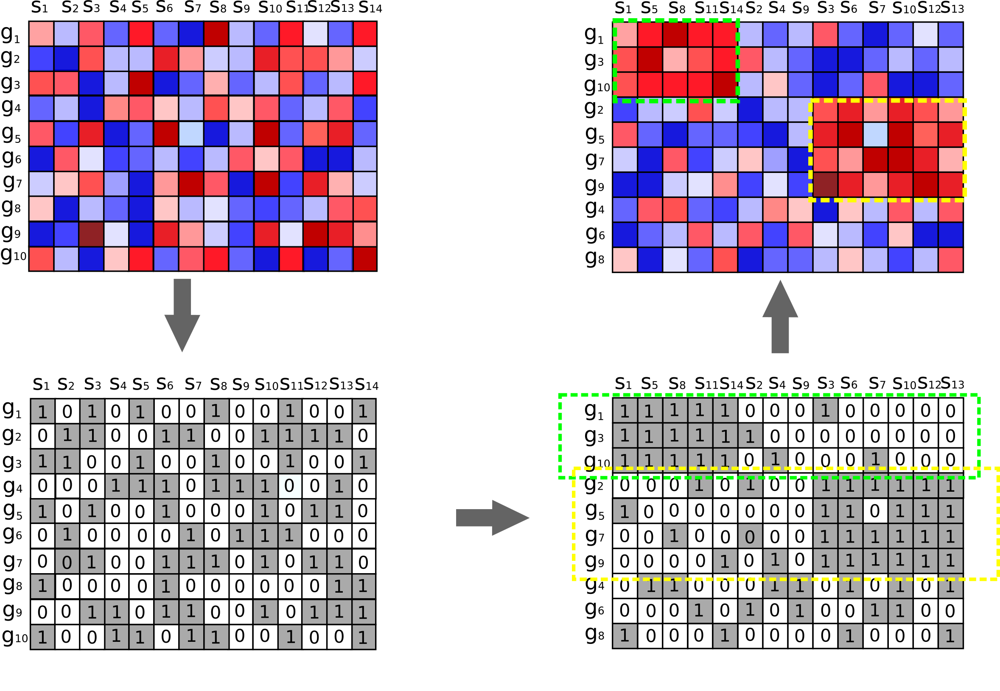

# UnPaSt

UnPaSt is a novel method for identification of differentially expressed biclusters.




## Install


### Docker environment
UnPaSt environment is available also as a Docker image.

```bash
docker pull freddsle/unpast
git clone https://github.com/ozolotareva/unpast.git
cd unpast
mkdir -p results

# running UnPaSt with default parameters and example data
command="python run_unpast.py --exprs test/scenario_B500.exprs.tsv.gz --basename results/scenario_B500"
docker run -u $(id -u):$(id -g) -v $(pwd):/data --entrypoint bash freddsle/unpast -c "cd /data && $command"
```


### Requirements:
```
Python (version 3.8.16):
    fisher==0.1.9
    pandas==1.3.5
    python-louvain==0.15
    matplotlib==3.7.1
    seaborn==0.11.1
    numba==0.51.2
    numpy==1.22.3
    scikit-learn==1.2.2
    scikit-network==0.24.0
    scipy==1.7.1
    statsmodels==0.13.2
    lifelines==0.27.4

R (version 4.3.1):
    WGCNA==1.70-3
    limma==3.42.2
```

### Installation tips

It is recommended to use "BiocManager" for the installation of WGCNA:
```R
install.packages("BiocManager")
library(BiocManager)
BiocManager::install("WGCNA")
```

## Examples
* UnPaSt requires a tab-separated file with features (e.g. genes) in rows, and samples in columns. Feature and sample names must be unique.

```bash
cd test;
mkdir -p results;

# running UnPaSt with default parameters and example data
python ../run_unpast.py --exprs scenario_B500.exprs.tsv.gz --basename results/scenario_B500

# with different binarization and clustering methods
python ../run_unpast.py --exprs scenario_B500.exprs.tsv.gz --basename results/scenario_B500 --binarization ward --clustering Louvain

# help
python run_unpast.py -h
```

* Consensus biclusters obtained in five runs of UnPaSt on 200 samples randomly chosen from TCGA-BRCA dataset: https://github.com/ozolotareva/DESMOND2/blob/main/consensus.ipynb

## Outputs
* \<basename\>.[parameters].biclusters.tsv - a .tsv table with found biclsuters, where
    - the first line starts from '#' and stores parameters
    - each following line represents a bicluster
    - SNR column contains SNR of a bicluster
    - columns "n_genes" and "n_samples" provide the numbers of genes and samples, respectively
    - "gene","sample" contain gene and sample names respectively
    - "gene_indexes" and  "sample_indexes" - 0-based gene and sample indexes in the input matrix.
* binarized expressions, background distributions of SNR for each bicluster size and binarization statistics [if clustering is WGCNA,  or  '--save_binary' flag is added]

## Versions
UnPaSt version used in PathoPlex paper: https://github.com/ozolotareva/DESMOND2/blob/main/UnPaSt_PathoPlex.zip

## Cite
UnPaSt preprint [https://arxiv.org/abs/2408.00200](https://arxiv.org/abs/2408.00200)

UnPaSt is an unconstrained version of DESMOND method ([repository](https://github.com/ozolotareva/DESMOND), [publication](https://academic.oup.com/bioinformatics/article/37/12/1691/6039116?login=true))

Major modifications:
 * it does not require the network of feature interactions
 * UnPaSt clusters individual features instead of pairs of features
 * uses 2-means, hierarchicla clustering or GMM for binarization of individual gene expressions
 * SNR threshold for featuer selection is authomatically determined; it depends on bicluster size in samples and user-defined p-value cutoff
